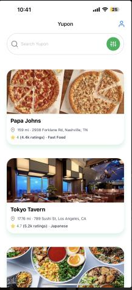
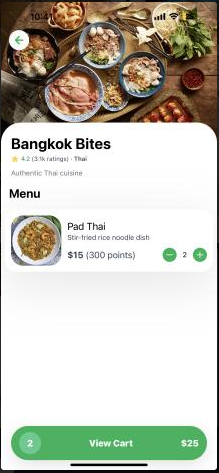
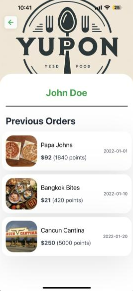
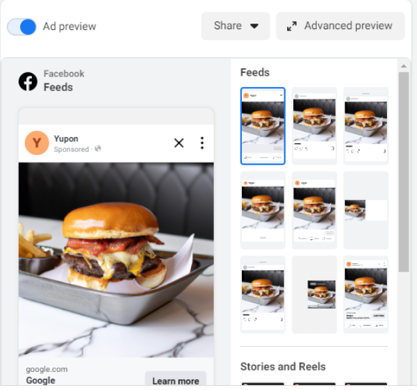

# Yupon AI 
### Team: The Twins
### Members: George Wang, Michael Wang, Jerry Chen (also a twin!)

# Description
Yupon AI is an AI marketing platform for locally-owned restaurants.

It has 2 distinct features:
### 1. Upload a menu to automatically generate a mobile rewards points app.
Restaurants can easily create a mobile ordering/rewards app just by uploading a picture of their menu. Yupon will use Google Cloud Vision's optical character recognition machine learning tool to automatically detect the menu items and generate a loyalty app based on that.

The app allows users to order with money or points and automatically generates the points value system. The app also has search, profile, and history capabilities.







### 2. Generate realistic AI food graphics to automatically start running ads and detect which graphics perform the best, allocating more funds towards those graphics.
Restaurants can easily create Facebook ad campaigns by just providing a budget, promotion, and description of the food. Yupon will use the description to automatically generate a few professional pictures of the food. After that, Yupon integrates with the Meta Marketing/Ads API to start running ads that point to the rewards app. Using machine learning, Yupon can optimize to see which ad performs the best and allocate more funds towards those.

Furthermore, Yupon can detect which placements perform the best (Stories, Reels, Feeds, Messenger), as well as using data on age, demographics, and interests to further optimize ad campaigns.



# Tech Stack
### Web Dashboard for Businesses
```
-Next.js 13

-Google Cloud Vision OCR

-OpenAI DALL-E API

-Meta/Facebook Ads API

-Auth0

-MongoDB

-Google Cloud Storage

-Tailwind CSS
```
### Mobile App
```
-React Native/Expo

-Auth0

-React-Redux
```
# Setup Instructions

### Yupon AI Web Dashboard

1. **Clone the repository:**
   ```bash
   git clone https://github.com/longjichen1/yupon-ai-pp.git
   ```

2. **Navigate to the project directory:**
   ```bash
   cd yupon-ai
   ```

3. **Install dependencies:**
   ```bash
   npm install
   ```

4. **Set up environment variables:** Create a `.env` file in the root directory and fill in the required API keys and secrets for Google Cloud Vision, OpenAI DALL-E, Meta/Facebook Ads API, Auth0, MongoDB, and Google Cloud Storage.

5. **Start the development server:**
   ```bash
   npm run dev
   ```

6. The Yupon AI dashboard should now be running on `http://localhost:3000`.

### Yupon React Native App

1. **Clone the mobile app repository:**
   ```bash
   git clone https://github.com/longjichen1/yupon-ai-pp.git
   ```

2. **Navigate to the app directory:**
   ```bash
   cd yupon
   ```

3. **Install dependencies:**
   ```bash
   npm install
   yarn install
   ```

4. **Set up environment variables:** Create a `.env` file in the root directory and set up the required variables for Auth0 and React-Redux.

5. **Start the app with Expo:**
   ```bash
   expo start -c
   ```

6. Scan the QR code using the Expo Go app on your mobile device or use an emulator to run the app.

---

Note: Ensure you have the required software tools and API access for the mentioned tech stack. The repositories mentioned in the setup instructions are examples and should be replaced with the actual GitHub repository URLs for your project.
